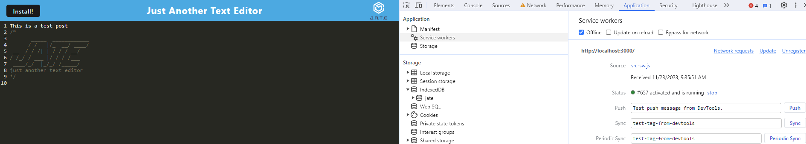
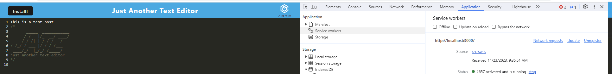

# Text Editor

## Description

To build a text editor that runs in the browser. The app will be a single-page application that meets the PWA criteria. Additionally, it will feature a number of data persistence techniques that serve as redundancy in case one of the options is not supported by the browser. The application will also function offline.


## User Story

```
AS A developer
I WANT to create notes or code snippets with or without an internet connection
SO THAT I can reliably retrieve them for later use
```

## Table of Contents

- [Text Editor](#text-editor)
  - [Description](#description)
  - [User Story](#user-story)
  - [Table of Contents](#table-of-contents)
  - [Usage](#usage)
  - [Technologies Used](#technologies-used)
  - [References](#references)
  - [Links](#links)
    - [GitHub Repository](#github-repository)
    - [Live Site](#live-site)
  - [License](#license)


## Usage



## Technologies Used

- JavaScript
- HTML
- ExpressJS
- Webpack


## References

- UT Austin Bootcamp Curriculum: Module 19
- Express.JS v.4.17.1: https://expressjs.com/en/starter/installing.html
- Webpack: https://webpack.js.org/ 


## Links

### <a href="https://github.com/KaiDoll/TextEditor">GitHub Repository</a>

### <a href="https://techblogfourteen-7c87d84e74e7.herokuapp.com/login">Live Site</a>


## License


Copyright 2023 - Tech Blog

Permission is hereby granted, free of charge, to any person obtaining a copy of this software and associated documentation files (the “Software”), to deal in the Software without restriction, including without limitation the rights to use, copy, modify, merge, publish, distribute, sublicense, and/or sell copies of the Software, and to permit persons to whom the Software is furnished to do so, subject to the following conditions:

The above copyright notice and this permission notice shall be included in all copies or substantial portions of the Software.

THE SOFTWARE IS PROVIDED “AS IS”, WITHOUT WARRANTY OF ANY KIND, EXPRESS OR IMPLIED, INCLUDING BUT NOT LIMITED TO THE WARRANTIES OF MERCHANTABILITY, FITNESS FOR A PARTICULAR PURPOSE AND NONINFRINGEMENT. IN NO EVENT SHALL THE AUTHORS OR COPYRIGHT HOLDERS BE LIABLE FOR ANY CLAIM, DAMAGES OR OTHER LIABILITY, WHETHER IN AN ACTION OF CONTRACT, TORT OR OTHERWISE, ARISING FROM, OUT OF OR IN CONNECTION WITH THE SOFTWARE OR THE USE OR OTHER DEALINGS IN THE SOFTWARE.
